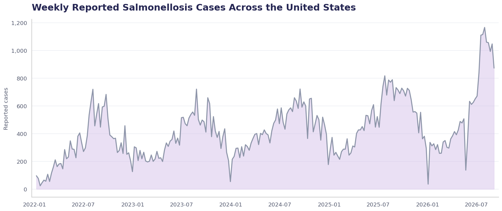
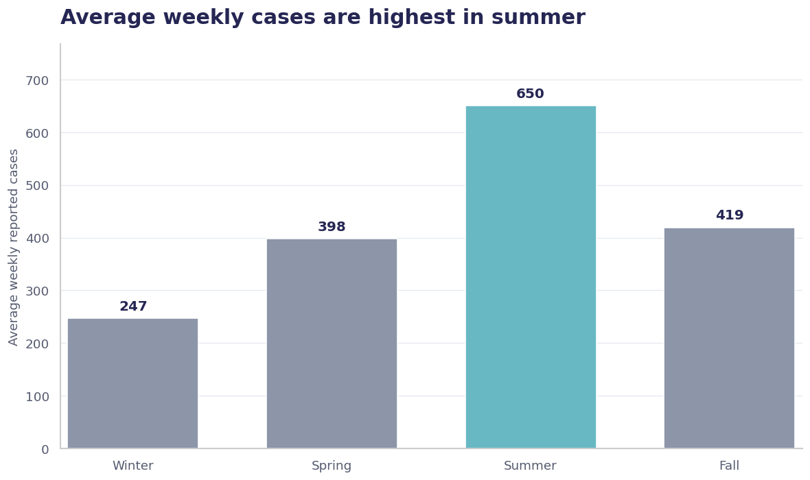
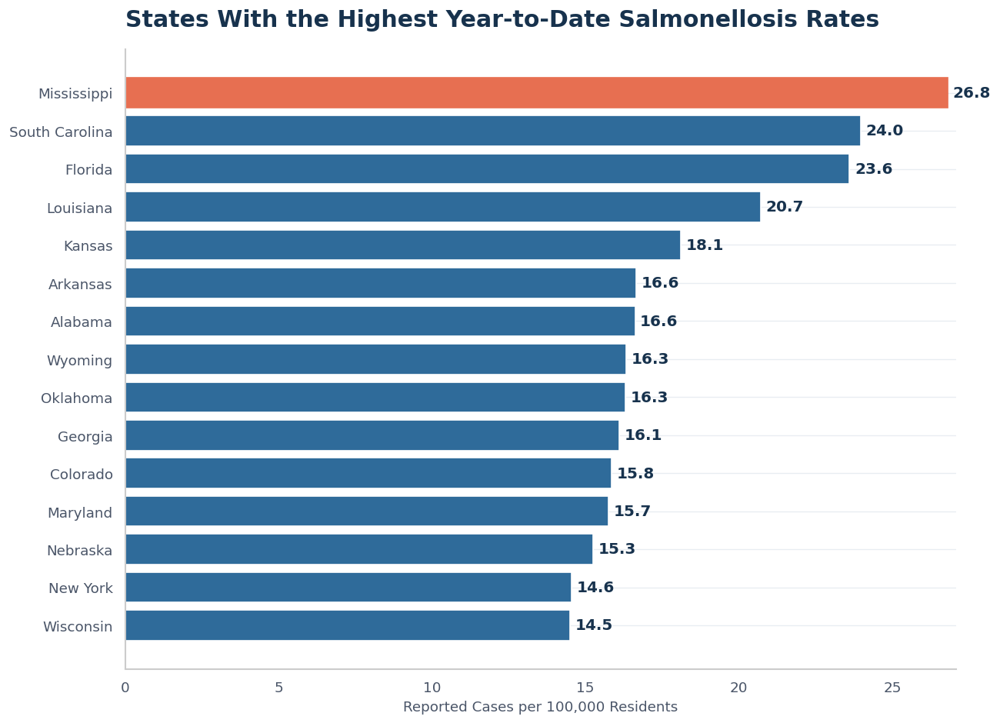
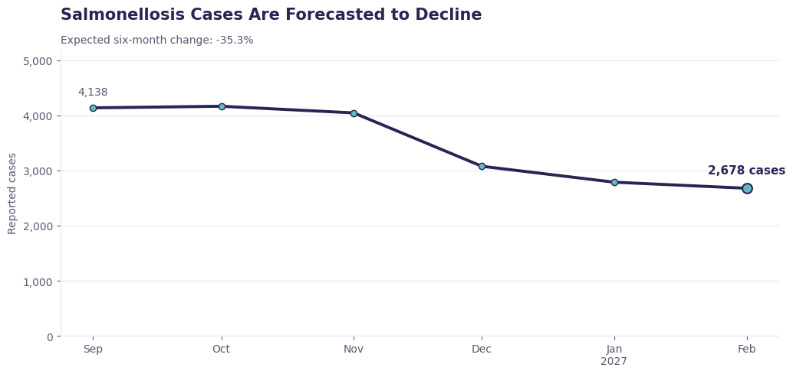

# Prepare Early for Seasonal Salmonellosis Surges

## Using weekly CDC reports to understand when and where cases increase

**Authors:** Siwar, Abdallah, and Husam

## Business Problem

Health departments need time to prepare for increases in Salmonellosis cases. If they can identify common patterns and estimate future cases, they can plan testing, staffing, and public health communication earlier.

This analysis answers four questions:

1. How have reported cases changed over time?
2. During which season do cases increase the most?
3. Which states have the highest reported rates compared with their population?
4. What should we expect over the next six months?

## Data

* **Source:** [CDC NNDSS Weekly Data](https://data.cdc.gov/NNDSS/NNDSS-Weekly-Data/x9gk-5huc/about_data)
* **Publisher:** Centers for Disease Control and Prevention
* **Disease:** Salmonellosis, excluding Typhi and Paratyphi infections
* **Time period:** 2022 to September 2026

The data contains weekly reported cases from U.S. states, territories, regions, and national summary areas.

Population estimates from the U.S. Census Bureau were also used to calculate state rates per 100,000 residents. This makes comparisons between states fairer than using total cases alone.

## Methods

* Reviewed the CDC data flags to understand why some values were missing.
* Changed weeks marked as having no reported cases to zero.
* Standardized reporting-area names.
* Grouped weekly national cases into monthly totals and used a time series forecasting model to project cases six months into the future.

## Results

### Weekly Reported Cases

> Reported cases change throughout the year rather than remaining at the same level. Repeated increases can be seen during warmer months especially in 2026.

### Cases Are Highest in Summer

> Summer had the highest average, with approximately **650 reported cases per week**. Winter had the lowest average, with approximately **247 cases per week**.

The seasonal pattern reached its highest point around **week 34**, which is usually in August. The monthly analysis also identified **August** as the highest month and **February** as the lowest.

### States With the Highest Reported Rates

> Mississippi had the highest year-to-date reported rate, with **26.8 cases per 100,000 residents** through week 35 of 2026.

### Forecast: Cases Expected to Decline Through Early 2027

> The forecast shows monthly reported cases falling from about **4,100 in September 2026 to about 2,700 by February 2027** — a decline of roughly **35%** over the next six months. This lines up with the seasonal pattern already seen in the data: cases peak in summer and taper off through fall and winter.

## Recommendations

* Prepare additional testing and public health resources before the summer increase.
* Pay closer attention to weekly reports during August and around week 34.
* Use population-adjusted rates when deciding which states may need more support.
* Compare new weekly cases with the normal seasonal level before treating an increase as a possible outbreak.
* Use the forecast to plan the seasonal wind-down of resources heading into fall and winter.
* Review reporting delays and missing data before making major decisions.

## Limitations and Next Steps

* The data contains reported cases, which may be lower than the true number of infections.
* Reporting practices and delays may differ between states.
* The latest year is incomplete, so it should not be compared directly with a full year.
* The state-rate analysis uses 2024 population estimates with 2026 case reports.
* A seasonal increase does not always mean that an unusual outbreak is happening.
* The forecast is based on monthly totals rather than weekly figures, so it should be read as a general trend rather than a week-by-week prediction.

The next steps are to:

* Track actual cases against the forecast as new weekly CDC data is published.
* Refresh the forecast on a regular schedule as new months of data become available.
* Create a clear rule for identifying unusually high weeks.
* Update the analysis when new CDC reports become available.

## For Further Information

* [CDC NNDSS Weekly Data](https://data.cdc.gov/NNDSS/NNDSS-Weekly-Data/x9gk-5huc/about_data)
* [Data preparation notebook](notebooks/01_preparing_data.ipynb)
* [Salmonellosis analysis notebook](notebooks/02_salmonellosis_analysis.ipynb)
* [Salmonellosis forecasting notebook](notebooks/03_salmonellosis_forecasting.ipynb)

For additional questions, please contact [Siwar Ehwass](mailto:siwarehwass@gmail.com).
