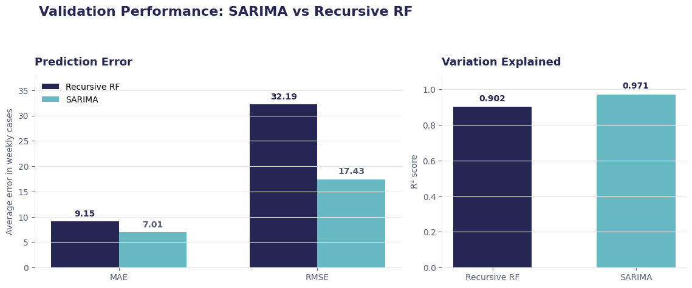
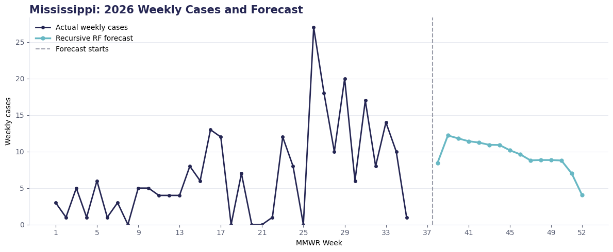
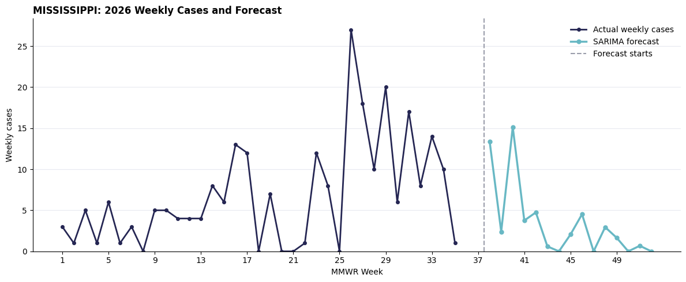
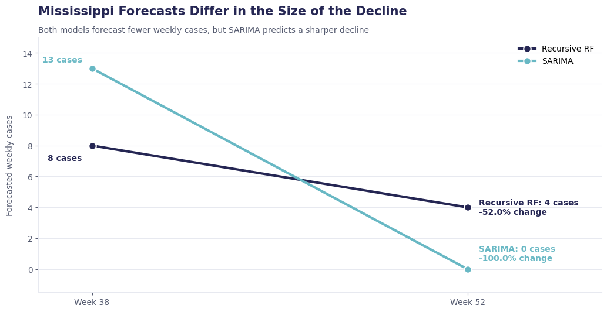

# Prepare Early for Seasonal Salmonellosis Surges

## Using Weekly CDC Reports to Support Earlier Public Health Planning

**Authors:** Siwar, Abdallah, and Husam

## Business Problem

Health departments need time to prepare for increases in Salmonellosis cases. Understanding seasonal patterns and estimating future cases can support earlier decisions about testing, staffing, and public health communication.

This analysis answers five questions:

1. How have reported cases changed over time?
2. During which season do cases increase the most?
3. Which states have the highest reported rates compared with their population?
4. How accurately can weekly cases be forecast across reporting areas?
5. How do SARIMA and a recursive Random Forest differ in their future forecasts?

## Data

- **Source:** [CDC NNDSS Weekly Data](https://data.cdc.gov/NNDSS/NNDSS-Weekly-Data/x9gk-5huc/about_data)
- **Publisher:** Centers for Disease Control and Prevention
- **Disease:** Salmonellosis, excluding Typhi and Paratyphi infections
- **Time period:** 2022 to September 2026

The original data contains weekly reports for around 120 diseases. This analysis focuses only on Salmonellosis.

The data includes reported cases from U.S. states, territories, regions, and national summary areas.

Population estimates from the U.S. Census Bureau were also used to calculate state rates per 100,000 residents. This allows states with different population sizes to be compared more fairly.

## Methods

- Reviewed the CDC data flags to understand why some values were missing.
- Changed weeks marked as having no reported cases to zero.
- Standardized reporting-area names.
- Calculated state rates per 100,000 residents.
- Studied weekly, monthly, and seasonal patterns.
- Kept the forecasting target at the weekly reporting-area level.
- Trained both forecasting approaches through week 37 and evaluated them on the same unseen 15-week period: weeks 38–52 of 2025.
- Fitted a separate SARIMA time-series model to each reporting area using only its earlier weekly case history.
- Built a recursive Random Forest using reporting area, week, season, previous cases, the previous 52-week maximum, and previous-year cumulative cases.
- Fed each Random Forest prediction into the next forecast step so that the validation matched a real multi-week forecast.
- Retrained the models using the latest available history and forecast weeks 38–52 of 2026.

## Results

### Weekly Reported Cases

> Reported cases change throughout the year instead of remaining at the same level. Repeated increases can be seen during warmer months, especially in 2026.

### Cases Are Highest in Summer

> Summer had the highest average, with approximately **650 reported cases per week**. Winter had the lowest average, with approximately **247 cases per week**.

The seasonal pattern reached its highest point around **week 34**, which is usually in August.

The monthly analysis also found that **August** had the highest number of cases, while **February** had the lowest.

### States With the Highest Reported Rates

> Mississippi had the highest year-to-date reported rate, with **26.8 cases per 100,000 residents** through week 35 of 2026.

### Weekly Forecast Validation

Both forecasting approaches were evaluated on the same reporting areas and the same unseen weeks. This made their results directly comparable.

> SARIMA produced the stronger validation results. Its average error was approximately **7 weekly cases**, compared with approximately **9 cases** for the Recursive Random Forest. SARIMA also achieved a higher R² score of **0.971**, compared with **0.902**.

SARIMA also had a lower RMSE, meaning it made fewer large forecasting errors across the validation data.

### Mississippi Recursive Random Forest Forecast

> The Recursive Random Forest forecast decreased from approximately **8 cases in week 38** to **4 cases in week 52**, a decline of approximately **52%**.

### Mississippi SARIMA Forecast

> The SARIMA forecast started at approximately **13 cases in week 38** and reached **0 cases by week 52**.

### Comparing the Two Mississippi Forecasts

> Both models forecast fewer weekly cases by the end of the period, but SARIMA predicts a much sharper decline. The different starting values are expected because the models learn from the historical data in different ways.

The Recursive Random Forest uses several features and repeatedly uses its own earlier predictions. SARIMA uses Mississippi’s weekly history and seasonal pattern.

These future values show what each model expects; they do not determine which model is more accurate. Accuracy was judged using the separate 2025 validation period.

## Recommendations

- Prepare additional testing and public health resources before the summer increase.
- Pay closer attention to weekly reports during August and around week 34.
- Use population-adjusted rates when deciding which states may need more support.
- Compare new cases with the normal seasonal level before treating an increase as a possible outbreak.
- Use SARIMA as the stronger forecasting approach for the current weekly planning task because it performed better during the shared validation period.
- Treat the difference between the Mississippi forecasts as a planning range rather than assuming that either exact path is guaranteed.
- Compare each new weekly report with both forecasts and investigate when actual cases move outside the expected pattern.
- Review missing values and reporting delays before making important decisions.

## Limitations

- The data contains reported cases, which may be lower than the true number of infections.
- Reporting practices and delays may differ between states.
- The latest year is incomplete, so it should not be compared directly with a full year.
- The state-rate analysis uses 2024 population estimates with 2026 case reports.
- A normal seasonal increase does not always mean an unusual outbreak is happening.
- The analysis includes states, territories, regions, and national summary areas with very different case levels.
- Large reporting areas may have a stronger effect on the overall performance results.
- The reported validation metrics combine all included reporting areas and may hide weaker performance in individual areas.
- The Mississippi charts are one example and should not be treated as the expected pattern for every state.
- The models produce estimates, not guaranteed future case counts.
- The Random Forest does not currently show a prediction interval, so its uncertainty is not visible in the final chart.
- Multi-week recursive forecasts can become less reliable because later predictions depend on earlier predicted values.

## Next Steps

- Repeat the validation using states only, without regional and national summary areas.
- Calculate prediction errors separately for every reporting area.
- Use walk-forward validation across several forecast periods instead of relying on one 15-week window.
- Add several lag and rolling-average features to the Recursive Random Forest.
- Add uncertainty ranges to both final forecasts.
- Compare the 2026 forecasts with actual cases as new CDC reports become available.
- Update the analysis when new CDC data becomes available.

## For Further Information

- [CDC NNDSS Weekly Data](https://data.cdc.gov/NNDSS/NNDSS-Weekly-Data/x9gk-5huc/about_data)
- [Data preparation notebook](notebooks/01_preparing_data.ipynb)
- [Salmonellosis analysis notebook](notebooks/02_salmonellosis_analysis.ipynb)
- [Salmonellosis forecasting notebook](notebooks/03_salmonellosis_forecasting.ipynb)
- [Machine-learning and deep-learning notebook](notebooks/04_salmonellosis_ml.ipynb)
- [Recursive Random Forest forecasting notebook](notebooks/05_salmonellosis_ml_forecast.ipynb)

For additional questions, please contact [Siwar Ehwass](mailto:siwarehwass@gmail.com).
